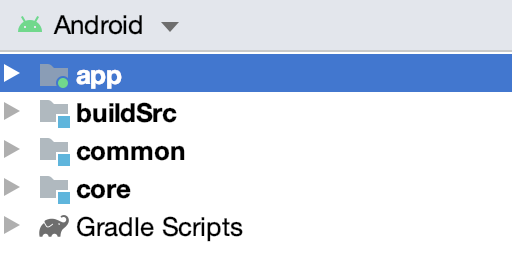
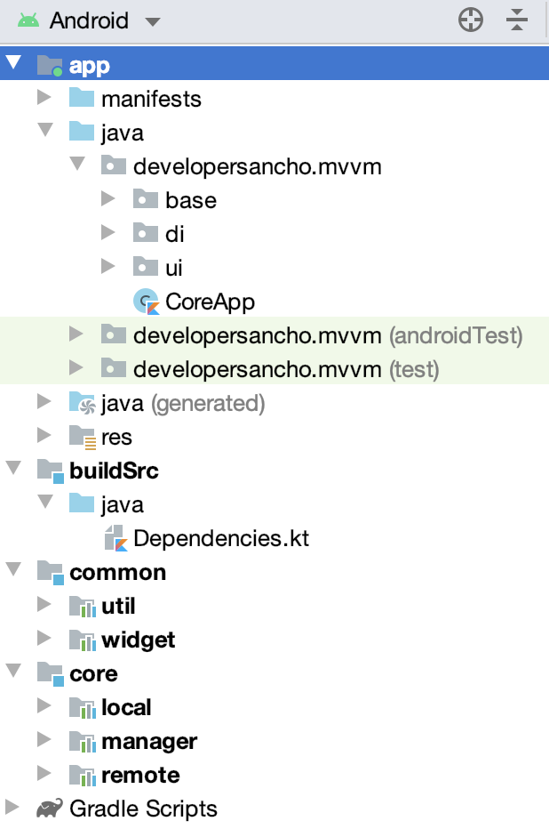

## CleanArchitectureMVVM

Example of Clean Architecture of Android app using MVVM, Koin, Coroutines, Retrofit, Room, Solid Principle, DRY, KISS, OOP, Unit Test

This Base Architecture project that presents modern, 2019 approach to [Android](https://www.android.com/) application development 
using [Kotlin](https://kotlinlang.org/)

The trick of the project is to demonstrate best practices, provide a set of guidelines, and present modern Android Application Architecture 
that is modular, scalable, maintainable and testable, suitable for bigger teams and long application lifecycle management.

## Environment setup
You require the latest Android Studio 3.6 RC1 (or newer) to be able to build the app.

## Multi-Module -1

## Multi-Module -2

### Dependencies

-   [Jetpack](https://developer.android.com/jetpack):
    -   [Android KTX](https://developer.android.com/kotlin/ktx.html) - provide concise, idiomatic Kotlin to Jetpack and Android platform APIs.
    -   [AndroidX](https://developer.android.com/jetpack/androidx) - major improvement to the original Android [Support Library](https://developer.android.com/topic/libraries/support-library/index), which is no longer maintained.
    -   [Benchmark](https://developer.android.com/studio/profile/benchmark.html) - handles warmup, measures your code performance, and outputs benchmarking results to the Android Studio console.
    -   [Data Binding](https://developer.android.com/topic/libraries/data-binding/) - allows you to bind UI components in your layouts to data sources in your app using a declarative format rather than programmatically.
    -   [View Binding](https://developer.android.com/topic/libraries/view-binding/) - allows you to bind UI components in your layouts to data sources in your app using a declarative format rather than programmatically.
    -   [Lifecycle](https://developer.android.com/topic/libraries/architecture/lifecycle) - perform actions in response to a change in the lifecycle status of another component, such as activities and fragments.
    -   [LiveData](https://developer.android.com/topic/libraries/architecture/livedata) - lifecycle-aware, meaning it respects the lifecycle of other app components, such as activities, fragments, or services.
    -   [Navigation](https://developer.android.com/guide/navigation/) - helps you implement navigation, from simple button clicks to more complex patterns, such as app bars and the navigation drawer.
    -   [Room](https://developer.android.com/topic/libraries/architecture/room) - persistence library provides an abstraction layer over SQLite to allow for more robust database access while harnessing the full power of SQLite.
    -   [ViewModel](https://developer.android.com/topic/libraries/architecture/viewmodel) - designed to store and manage UI-related data in a lifecycle conscious way. The ViewModel class allows data to survive configuration changes such as screen rotations.
-   [Coroutines](https://kotlinlang.org/docs/reference/coroutines-overview.html) - managing background threads with simplified code and reducing needs for callbacks.
-   [Coroutines-Flow](https://kotlinlang.org/docs/reference/coroutines/flow.html) - suspending functions asynchronously returns a single value, but how can we return multiple asynchronously computed values? This is where Kotlin Flows come in.
-   [Koin](https://insert-koin.io/) - dependency injector for replacement all FactoryFactory classes.
-   [Retrofit](https://square.github.io/retrofit/) - type-safe HTTP client.
-   [Glide](https://github.com/bumptech/glide) -  image loading and caching library for Android focused on smooth scrolling.
-   [Gson](https://github.com/google/gson) - makes it easy to parse JSON into Kotlin objects.
-   [Timber](https://github.com/JakeWharton/timber) - a logger with a small, extensible API which provides utility on top of Android's normal Log class.
-   [Gradle Kotlin DSL](https://github.com/gradle/kotlin-dsl-samples) - makes it easy to manage dependency all module that we have
-   [and more...](https://github.com/developersancho/CleanArchitectureMVVM/blob/development/buildSrc/src/main/java/Dependencies.kt)

### Test Dependencies

-   [Robolectric](https://github.com/robolectric/robolectric) - industry-standard unit testing framework for Android.
-   [JUnit](https://github.com/junit-team/junit4) - a simple framework to write repeatable tests. It is an instance of the xUnit architecture for unit testing frameworks.
-   [Koin Test](https://start.insert-koin.io/#/getting-started/testing) - project brings you small but powerfull tools to test your Koin application.
-   [Coroutine Test](https://github.com/Kotlin/kotlinx.coroutines/tree/master/kotlinx-coroutines-test) - provides testing utilities for effectively testing coroutines.
-   [and more...](https://github.com/developersancho/CleanArchitectureMVVM/blob/development/buildSrc/src/main/java/Dependencies.kt)

### Plugins
-   [Versions](https://github.com/ben-manes/gradle-versions-plugin) - make easy to determine which dependencies have updates.
-   [SafeArgs](https://developer.android.com/guide/navigation/navigation-pass-data#Safe-args) - generates simple object and builder classes for type-safe navigation and access to any associated arguments.

## Contributions

All contributions are welcome!
Please feel free to post questions, recommendations, ideas, bugs by create [new issue](https://github.com/developersancho/CleanArchitectureMVVM/issues/new) following the template or if you want create directly [new pull request](https://github.com/developersancho/CleanArchitectureMVVM/compare).

## License
    Copyright 2019 developersancho.
    
    Licensed under the Apache License, Version 2.0 (the "License");
    you may not use this file except in compliance with the License.
    You may obtain a copy of the License at

       http://www.apache.org/licenses/LICENSE-2.0

    Unless required by applicable law or agreed to in writing, software
    distributed under the License is distributed on an "AS IS" BASIS,
    WITHOUT WARRANTIES OR CONDITIONS OF ANY KIND, either express or implied.
    See the License for the specific language governing permissions and
    limitations under the License.